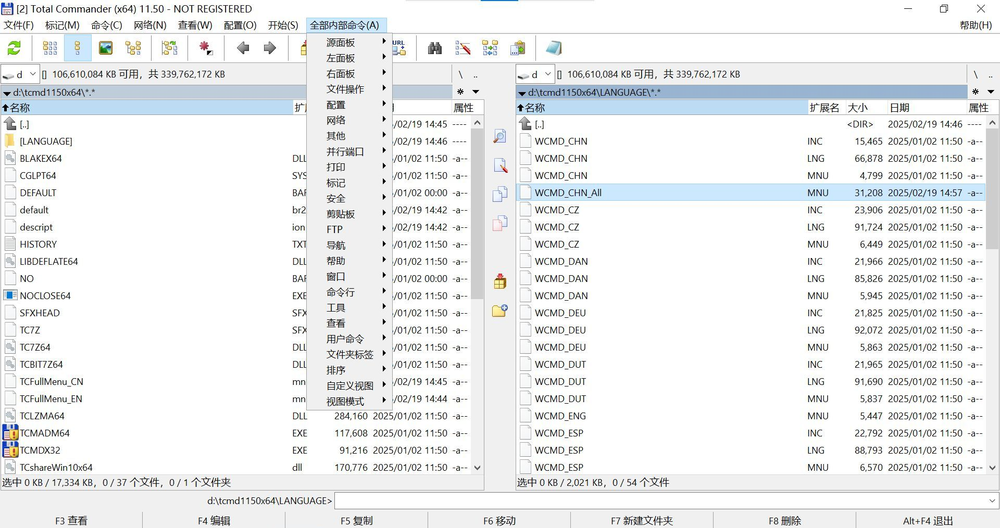

# TCFullMenuGenerator

## 利用Total Commander官方文件生成完整的(最全的)主菜单文件
- 功能: 生成一个最完整最全的扩展菜单文件, 并且汉化, 而且可以方便的升级.
- 原理: 先利用 TOTALCMD.INC 生成英文的扩展菜单文件; 然后再利用WCMD_CHN.INC将其汉化. 全部用python实现
- 当然也有不足, 这个菜单没有显示命令的快捷键, 也不支持 Alt 激活菜单, 然后通过字母选择菜单的功能.

## 使用方法:
- 先运行TCFullMenuGenerator.py, 生成英文版TCFullMenu_EN.mnu
- 再运行TCMenuEN2CN.py, 生成中文版TCFullMenu_CN.mnu

